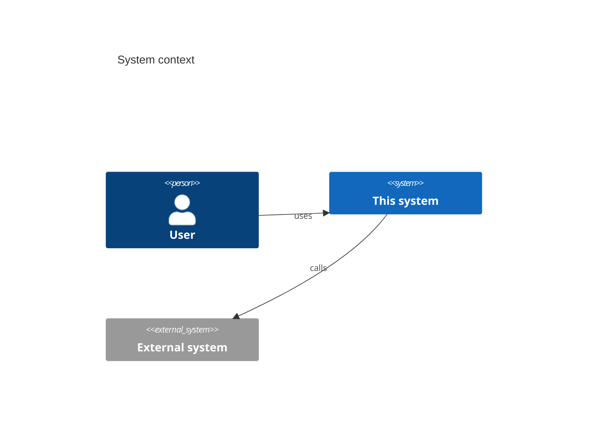
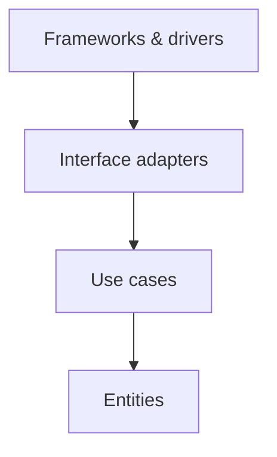
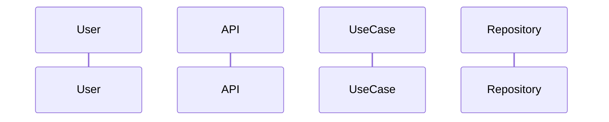

# Architecture: <Feature or system>

| Field | Value |
|-------|-------|
| Status | Draft / In review / Approved |
| Author | solution-architect agent |
| Approver | <tech lead> |
| Approved on | <YYYY-MM-DD> |
| PRD | PRD-NNN |
| Stories | STORY-NNN, ... |
| ADRs | 0001, 0002, ... |

## 1. Summary

Two or three paragraphs: what is being built, the architecture style chosen, and the main
trade-offs.

## 2. Requirements restated

Short restatement of the goals, must-have requirements, and non-functional budgets this design
must satisfy. Note anything sent back to the product owner.

## 3. Context



External systems, actors, and trust boundaries.

## 4. Containers and components

```mermaid
C4Container
  title Containers
```

For each container: responsibility, technology, owner, scaling model.

## 5. Clean Architecture layering



Per component, list what lives in each layer and the ports (interfaces) the use-case layer
defines. State how the domain is tested without I/O.

## 6. Design elements

### DES-NNN: <Name>

- **Layer:** entities / use cases / interface adapters / frameworks
- **Satisfies:** REQ-NNN, STORY-NNN
- **Responsibility:**
- **Interfaces exposed / consumed:**
- **Failure modes and handling:**
- **Security controls:** (reference threat model)

(Repeat.)

## 7. Key flows

One sequence diagram per story for the main flow, and one for the most important failure flow.



## 8. Data

Pointer to `data-model.md`. Summary of ownership, consistency model, and migrations.

## 9. API contracts

Pointer to files in `api/`. Versioning, error format, pagination, idempotency, rate limits.

## 10. Cross-cutting concerns

| Concern | Decision | Where implemented |
|---------|----------|-------------------|
| Observability | | |
| Reliability | | |
| Performance and scalability | | |
| Testability | | |
| Delivery (CI/CD, environments, flags, rollback) | | |
| Configuration and secrets | | |
| Accessibility / i18n | | |
| Compliance and privacy | | |
| Operational ownership | | |

## 11. Security summary

Pointer to `threat-model-<feature>.md`. Top three risks and their controls.

## 12. Traceability

| REQ / STORY | DES elements | Notes |
|-------------|--------------|-------|

## 13. Decisions pending

Decisions the tech lead must make, each with the recommended option first.

## 14. Implementation conventions

What was added to `CLAUDE.md` for the Implement phase.
